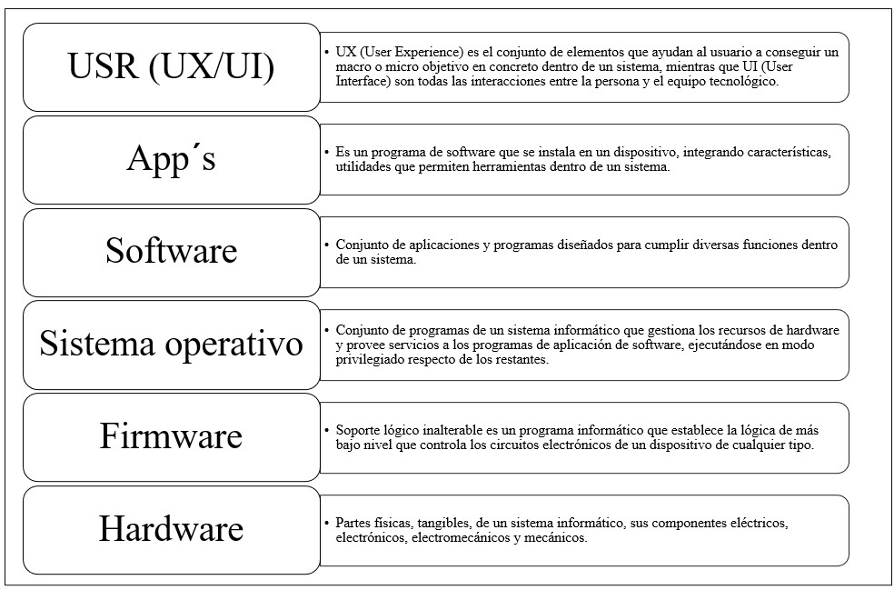
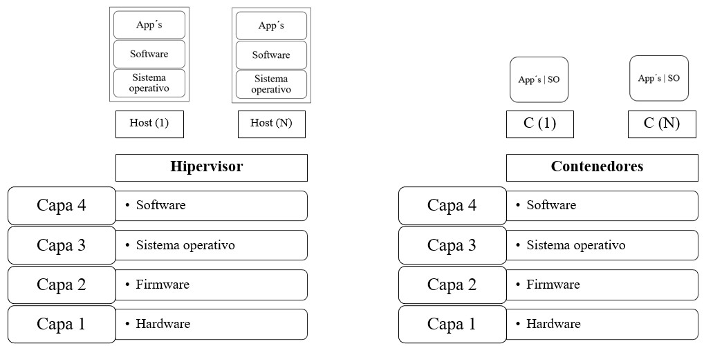

### **¿Qué son los hipervisores y los contenedores?**




**Hipervisores**: Los hipervisores son software o firmware que permiten crear y gestionar máquinas virtuales (VMs). Estas máquinas virtuales ejecutan sistemas operativos completos de manera aislada en un mismo hardware físico.  
   Ejemplos: VMware, Hyper-V, Xen, KVM.

**Contenedores**: Los contenedores son una tecnología de virtualización a nivel de sistema operativo que permite ejecutar aplicaciones de manera aislada en entornos ligeros, compartiendo el kernel del sistema operativo base.  
   Ejemplos: Docker, Kubernetes (para orquestación de contenedores).

### **Tabla comparativa: Hipervisores vs Contenedores**

| **Aspecto**                 | **Hipervisores**                                              | **Contenedores**                                              |
|-----------------------------|-------------------------------------------------------------|-------------------------------------------------------------|
| **Nivel de virtualización**  | Virtualización a nivel de hardware (máquinas virtuales).     | Virtualización a nivel del sistema operativo.               |
| **Aislamiento**              | Cada máquina virtual tiene su propio sistema operativo.      | Comparte el kernel del sistema operativo base.              |
| **Peso**                     | Más pesados, requieren más recursos (RAM, CPU, almacenamiento). | Ligeros, consumen menos recursos gracias a la compartición del kernel. |
| **Inicio**                   | Más lento, ya que implica arrancar un sistema operativo completo. | Muy rápido, ya que los contenedores arrancan solo la aplicación. |
| **Flexibilidad de SO**       | Permite ejecutar diferentes sistemas operativos (Windows, Linux, etc.). | Limitado al sistema operativo del host.                    |
| **Casos de uso principales** | Entornos que requieren virtualización completa y fuerte aislamiento. | Microservicios, despliegue rápido y escalabilidad ligera.   |
| **Seguridad**                | Más seguro debido al aislamiento completo de hardware.        | Menos seguro, ya que los contenedores comparten el kernel.  |
| **Gestión**                  | Más compleja, requiere gestión de sistemas operativos independientes. | Más sencilla, ya que solo se gestionan las aplicaciones.    |
| **Escalabilidad**            | Menos escalable, debido al alto consumo de recursos.          | Altamente escalable, ideal para entornos dinámicos.         |

### **¿Cuándo usar cada uno?**

| **Escenario**                                          | **Hipervisores**                                                | **Contenedores**                                              |
|-------------------------------------------------------|---------------------------------------------------------------|-------------------------------------------------------------|
| Necesitas ejecutar diferentes sistemas operativos.     | ✅ Ideal, ya que permite ejecutar múltiples sistemas operativos. | ❌ No es posible, los contenedores comparten el mismo kernel. |
| Recursos de hardware limitados.                       | ❌ Requiere más recursos.                                       | ✅ Mejor opción por su ligereza.                            |
| Aislamiento de seguridad completo.                    | ✅ Ofrecen mayor aislamiento entre sistemas.                   | ❌ Menor aislamiento, ya que comparten el kernel.           |
| Despliegue rápido y continuo (DevOps).                | ❌ Más lento en iniciar y menos eficiente en este caso.         | ✅ Perfecto, despliegue y escalabilidad rápidos.            |
| Ambiente de pruebas o desarrollo de software.         | ✅ Para simular diferentes sistemas operativos.                | ✅ Para ejecutar aplicaciones individuales en entornos consistentes. |
| Orquestación de microservicios.                       | ❌ No es eficiente ni diseñado para este propósito.             | ✅ Diseñado para aplicaciones distribuidas y escalables.    |
| Infraestructura de nube híbrida o multi-nube.         | ✅ Adecuado para VM en infraestructura distribuida.            | ✅ Ideal para aplicaciones portátiles y ligeras.            |

### **Pasos para instalar Podman Desktop**

#### **1. Verificar los requisitos previos**
Antes de instalar, asegúrate de que tu sistema cumpla con los siguientes requisitos:
- **Sistema Operativo**: Windows, macOS o Linux (Distribuciones basadas en Debian, Red Hat, etc.).
- **Recursos mínimos**:
  - Procesador moderno compatible con virtualización.
  - Al menos 2 GB de RAM.
- **Permisos de administrador/root**: Necesarios para completar la instalación.

#### **2. Descargar Podman Desktop**
**Accede al sitio oficial** de Podman Desktop:  
   [https://podman.io](https://podman.io).
   
En a la sección de descargas y selecciona tu sistema operativo:
   - **Windows**: Descarga el archivo `.exe`.
   - **macOS**: Descarga el archivo `.dmg`.
   - **Linux**: Sigue las instrucciones según tu distribución.

#### **3. Instalación según el sistema operativo**

##### **Windows**
Ejecutar el archivo descargado (`Podman-Desktop-Installer.exe`).
Siguir las instrucciones del asistente de instalación:
   - Acepta los términos de uso.
   - Elige una ruta de instalación (o usa la predeterminada).
Finalizar la instalación y reinicia el sistema si es necesario.

##### **macOS**
Abrir el archivo `.dmg` descargado.
Arrastrar el icono de **Podman Desktop** a la carpeta **Aplicaciones**.
Abrir la aplicación desde **Launchpad** y sigue las configuraciones iniciales.

##### **Linux**
El proceso varía según tu distribución. Aquí tienes ejemplos para las más comunes:

- **Ubuntu/Debian**:
  ```bash
  sudo apt update
  wget https://github.com/containers/podman-desktop/releases/latest/download/podman-desktop-linux.deb
  sudo apt install ./podman-desktop-linux.deb
  ```

- **Fedora/Red Hat**:
  ```bash
  sudo dnf install https://github.com/containers/podman-desktop/releases/latest/download/podman-desktop-linux.rpm
  ```

#### **4. Configuración inicial**
Abrir Podman Desktop.
Si es la primera vez en utilizar Podman, seleccionar o instalar un backend:
   - **Linux**: Podman ya estará configurado de forma nativa.
   - **Windows/macOS**: Es posible que necesites instalar **WSL 2** (Windows) o configurar un entorno de virtualización como Lima (macOS).
Configurar los recursos (CPU, RAM, almacenamiento) según sea necesario.

#### **5. Probar la instalación**
Abrir Podman Desktop y crea un contenedor de prueba:
   - Desde la interfaz gráfica, selecciona **New Container**.
   - Elige una imagen base como `nginx` o `alpine`.
Verificar que el contenedor se esté ejecutando correctamente:
   - Puedes acceder al log desde Podman Desktop.
   - Accede al contenedor si es un servidor web, por ejemplo, en el navegador.

______________

### ¿Qué es YAML?  
YAML (YAML Ain't Markup Language) es un formato de serialización de datos diseñado para ser legible por humanos. Es ampliamente utilizado para definir configuraciones debido a su simplicidad y claridad. YAML utiliza una estructura basada en sangrías y no requiere llaves ni corchetes como otros formatos como JSON o XML.

### Sintaxis de YAML  
- **Estructura jerárquica**: Se organiza por niveles de sangría.
- **Claves y valores**: Las claves se separan de los valores mediante `:`.
- **Listas**: Se definen usando guiones (`-`).
- **Comentarios**: Se escriben con `#`.
- **Bloques literales**: Los valores multilinea se definen con `|` o `>`.

Ejemplo básico:
```yaml
persona:
  nombre: "Oswaldo"
  edad: 50
  habilidades:
    - ciberseguridad
    - privacidad de datos
    - normatividad en TICs
  contacto:
    correo: oswaldo.diaz@inegi.org.mx
    teléfono: "+52 449 910 53 00"
```

### Uso de YAML en el contexto de contenerización  
En el ámbito de la contenerización, YAML se utiliza ampliamente para describir configuraciones en herramientas como Docker Compose y Podman Compose. Estas herramientas permiten definir múltiples servicios en un solo archivo, facilitando la orquestación de contenedores.

#### Ejemplo con Docker Compose  
Archivo `docker-compose.yml` para levantar una aplicación web y una base de datos:  
```yaml
version: '3.8'
services:
  web:
    image: nginx:latest
    ports:
      - "8080:80"
    volumes:
      - ./html:/usr/share/nginx/html
    depends_on:
      - db

  db:
    image: postgres:latest
    environment:
      POSTGRES_USER: user
      POSTGRES_PASSWORD: password
      POSTGRES_DB: mydatabase
    volumes:
      - db_data:/var/lib/postgresql/data

volumes:
  db_data:
```

**Versión**: Define la versión del esquema YAML para Docker Compose. En este caso, `3.8`.
**Servicios**: Agrupa los contenedores que se usarán:
   - `web`: Define un servicio que usa la imagen de NGINX y mapea el puerto 8080 en el host al 80 en el contenedor.
   - `db`: Configura una base de datos PostgreSQL con variables de entorno para el usuario, contraseña y base de datos.
**Volúmenes**: Crea un volumen persistente para almacenar los datos de PostgreSQL.

#### Ejemplo con Podman Compose  
Podman Compose usa un archivo similar al de Docker Compose. Para el mismo caso:
```yaml
version: '3.8'
services:
  web:
    image: nginx:latest
    ports:
      - "8080:80"
    volumes:
      - ./html:/usr/share/nginx/html
    depends_on:
      - db

  db:
    image: postgres:latest
    environment:
      POSTGRES_USER: user
      POSTGRES_PASSWORD: password
      POSTGRES_DB: mydatabase
    volumes:
      - db_data:/var/lib/postgresql/data

volumes:
  db_data:
```

La sintaxis es idéntica porque Podman Compose busca ser compatible con Docker Compose. Ambos generan y gestionan contenedores usando el mismo estándar YAML.


### **Referencias bibliográficas**

> Red Hat. (2023). What is Podman?. Red Hat. Recuperado de https://www.redhat.com/en/topics/containers/what-is-podman

> Podman.io. (2023). Podman Desktop Documentation. Recuperado de https://podman.io/getting-started/installation

> Graba, J. (2022). Managing containers with Podman: A step-by-step guide for developers and sysadmins. TechPress.

> Jain, R. (2021). Containerization with Podman and Docker: A practical guide to modern container technologies. Springer.

> IBM Cloud. (2023). Podman vs Docker: Key differences explained. IBM Knowledge Center. Recuperado de https://www.ibm.com/cloud/blog/podman-vs-docker

> Docker Inc. (2023). *Overview of Docker Compose*. Recuperado de https://docs.docker.com/compose/

> Podman Team. (2023). *Podman Compose User Guide*. Recuperado de https://podman.io/

> Ben-Kiki, O., Evans, C., & döt Net, I. (2009). *YAML Ain't Markup Language (YAML™) Version 1.2*. Recuperado de https://yaml.org/spec/1.2/spec.html

> Turnbull, J. (2018). *The Docker Book: Containerization is the New Virtualization*. Independently Published.

> Kelsey, C. (2020). *Programming Containers: Understanding Docker and YAML for Orchestration*. O'Reilly Media.
_____________________________
> By CISO oswaldo.diaz@inegi.org.mx
